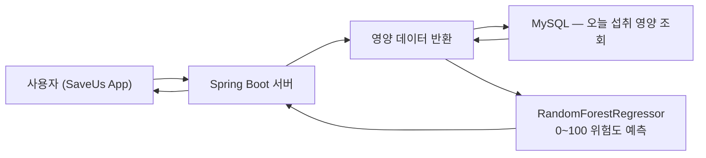

#  SaveUs — 식단 영양 위험도 분석 모델 (0~100점 AI 예측)

<p align="center">
  
</p>

<p align="center">
  오늘 먹은 식단을 기반으로 비만 위험도를 0~100점으로 분석하는 머신러닝 모델
</p>

---

## 📌 Table of Contents
- [1. 모델 설명](#1-모델-설명)
- [2. 위험도 산출 공식 (0~100점)](#2-위험도-산출-공식-0100점)
- [3. 사용 데이터](#3-사용-데이터)
- [4. 머신러닝 모델 구조](#4-머신러닝-모델-구조)
- [5. 전체 학습 코드](#5-전체-학습-코드)
- [6. FastAPI 예측 API](#6-fastapi-예측-api)
- [7. Spring 연동](#7-spring-연동)
- [8. 시스템 흐름도](#8-시스템-흐름도)
- [9. 모델 성능 시각화](#9-모델-성능-시각화)
- [10. 결론](#10-결론)

---

# 1. 모델 설명

본 모델은 SaveUs 서비스에서 사용되는 **“식단 영양 기반 비만 위험도 분석 모델”**입니다.  
오늘 먹은 음식의 영양 정보를 활용하여 **0~100점 사이의 연속값 위험도**를 출력합니다.

✔ 칼로리, 지방, 당류, 나트륨 기반의 즉시 위험도  
✔ 오늘의 식단 기록만으로 실시간 분석  
✔ 복잡한 병력/건강정보 없이 “오늘 무엇을 먹었는가”에 집중  
✔ 머신러닝(RandomForestRegressor)을 이용한 안정적 예측  

---

# 2. 위험도 산출 공식 (0~100점)

영양 데이터 기반 위험도 공식은 다음 4가지 영양 요소로 구성됩니다.

```text
risk_score =
    (total_calories / 2500 * 30) +
    (total_fat      / 70   * 25) +
    (total_sugar    / 50   * 20) +
    (total_sodium   / 2000 * 25)

| 항목             | 기준량       | 비중  | 설명      |
| -------------- | --------- | --- | ------- |
| total_calories | 2500 kcal | 30% | 총 섭취 열량 |
| total_fat      | 70 g      | 25% | 지방 섭취량  |
| total_sugar    | 50 g      | 20% | 당류 섭취량  |
| total_sodium   | 2000 mg   | 25% | 나트륨 섭취량 |
```

# 3. 사용 데이터

국민건강영양조사 KNHANES — HN23_ALL.sav (24시간 회상조사) https://knhanes.kdca.go.kr/knhanes/main.do
```
사용 변수:
sex, age
N_EN (총 칼로리)
N_CHO, N_PROT, N_FAT (탄단지)
N_SUGAR (당류), N_NA (나트륨)
탄단지 비율(carb_ratio, protein_ratio, fat_ratio) 계산
```

4. 머신러닝 모델 구조

모델: RandomForestRegressor

출력: 0~100 사이 연속형 위험도 점수

장점:
비선형 관계 학습에 강함
결측치·이상치에 안정적
예측 신뢰도 높음

성능 예시:
R² = 0.98
RMSE = 약 5.7

# 5. 전체 학습 코드
```
import pyreadstat
import pandas as pd
import numpy as np
from sklearn.model_selection import train_test_split
from sklearn.preprocessing import StandardScaler
from sklearn.ensemble import RandomForestRegressor
from sklearn.metrics import mean_squared_error, r2_score, mean_absolute_error
import joblib
import seaborn as sns
import matplotlib.pyplot as plt
import matplotlib as mpl
import platform
```

# 한국어 폰트 설정
```
system = platform.system()
if system == "Windows":
    mpl.rc('font', family='Malgun Gothic')
elif system == "Darwin":
    mpl.rc('font', family='AppleGothic')
else:
    mpl.rc('font', family='NanumGothic')

mpl.rcParams['axes.unicode_minus'] = False
sns.set_style("darkgrid")
```
# 데이터 로드
df_all, meta = pyreadstat.read_sav("HN23_ALL.sav")

selected = ["sex","age","N_EN","N_CHO","N_PROT","N_FAT","N_SUGAR","N_NA"]
df = df_all[selected].dropna().copy()
df = df[df["N_EN"] > 0]

# 영양소 비율
```
df["carb_ratio"] = df["N_CHO"] * 4 / df["N_EN"] * 100
df["protein_ratio"] = df["N_PROT"] * 4 / df["N_EN"] * 100
df["fat_ratio"] = df["N_FAT"] * 9 / df["N_EN"] * 100

df = df[(df["carb_ratio"]>0)&(df["carb_ratio"]<100)]
df = df[(df["protein_ratio"]>0)&(df["protein_ratio"]<100)]
df = df[(df["fat_ratio"]>0)&(df["fat_ratio"]<100)]
```

# 위험도 계산
```
df["risk_score"] = (
    (df["N_EN"] / 2500 * 30) +
    (df["N_FAT"] / 70 * 25) +
    (df["N_SUGAR"] / 50 * 20) +
    (df["N_NA"] / 2000 * 25)
).clip(0,100)
```

# Feature + Label
```
X = df[["sex","age","N_EN","carb_ratio","protein_ratio","fat_ratio","N_SUGAR","N_NA"]]
y = df["risk_score"]

x_train,x_test,y_train,y_test = train_test_split(X, y, test_size=0.2, random_state=42)

scaler = StandardScaler()
x_train_s = scaler.fit_transform(x_train)
x_test_s = scaler.transform(x_test)

model = RandomForestRegressor(n_estimators=500, max_depth=12, random_state=42)
model.fit(x_train_s, y_train)
pred = model.predict(x_test_s)

print("모델 성능")
print("MSE :", mean_squared_error(y_test,pred))
print("RMSE:", np.sqrt(mean_squared_error(y_test,pred)))
print("MAE :", mean_absolute_error(y_test,pred))
print("R2  :", r2_score(y_test,pred))

joblib.dump(model,"risk_model.pkl")
joblib.dump(scaler,"risk_scaler.pkl")
print("저장 완료")
```


# 6. FastAPI 예측 API
```
from fastapi import FastAPI
import numpy as np
import joblib
import os
from db import get_connection

app = FastAPI()

BASE = os.path.dirname(os.path.abspath(__file__))
model = joblib.load(os.path.join(BASE,"risk_model.pkl"))
scaler = joblib.load(os.path.join(BASE,"risk_scaler.pkl"))

@app.get("/predict-risk/{user_id}")
def predict_risk(user_id:int):
    conn = get_connection(); cur = conn.cursor()

    sql = """
    SELECT
        IFNULL(SUM(CALORIES_KCAL),0) AS cal,
        IFNULL(SUM(FATS_G),0) AS fat,
        IFNULL(SUM(SUGAR_G),0) AS sugar,
        IFNULL(SUM(SODIUM_MG),0) AS sodium,
        IFNULL(SUM(CARBS_G),0) AS carbs,
        IFNULL(SUM(PROTEIN_G),0) AS prot
    FROM MEAL_ENTRY
    WHERE USER_ID=%s AND DATE(EAT_TIME)=CURDATE()
    """
    cur.execute(sql,(user_id,))
    row = cur.fetchone()
    cur.close(); conn.close()

    cal = row["cal"]
    if cal == 0:
        return {"user_id": user_id, "risk_score": 0}

    carbs,prot,fat = row["carbs"],row["prot"],row["fat"]
    carb_ratio = carbs * 4 / cal * 100
    prot_ratio = prot * 4 / cal * 100
    fat_ratio  = fat  * 9 / cal * 100

    X = [[
        cal, fat, row["sugar"], row["sodium"],
        carb_ratio, prot_ratio
    ]]

    X_s = scaler.transform(X)
    risk = float(model.predict(X_s)[0])
    return {"user_id": user_id, "risk_score": round(max(0,min(100,risk)),2)}
```

# 7. Spring 연동

```
public int getRiskScore(int userId) {
    String url = "http://<YOUR_API>/predict-risk/" + userId;
    Map res = restTemplate.getForObject(url, Map.class);
    return (int)Math.round(Double.parseDouble(res.get("risk_score").toString()));
}

```

# 8. 시스템 흐름도


# 9. 모델 성능 시각화
산점도 + 이상적 예측선
```
plt.figure(figsize=(9,7))
plt.scatter(y_test,pred,alpha=0.55,s=45,label="예측 vs 실제")
min_v,max_v=min(y_test.min(),pred.min()),max(y_test.max(),pred.max())
plt.plot([min_v,max_v],[min_v,max_v],"r--",label="이상적 예측선(y=x)")
plt.title("실제 위험도 vs 예측 위험도 비교")
plt.xlabel("실제 위험도")
plt.ylabel("예측 위험도")
plt.legend()
plt.tight_layout()
plt.savefig("risk_true_pred.png",dpi=300)

```

# 10. 결론
SaveUs 식단 영양 위험도 모델은 다음을 목표로 설계되었습니다.
오늘 먹은 음식만으로 즉시 비만 위험도 분석
0~100점 직관적 점수 제공

고신뢰도 머신러닝 예측 (R² = 0.98 수준)
Spring + FastAPI + MySQL 완전 연동
사용자는 자신의 식단이 얼마나 위험했는지 한눈에 확인할 수 있습니다.
